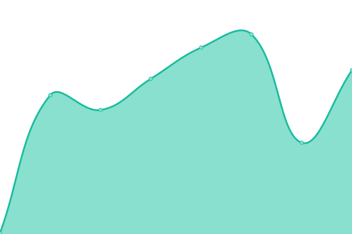
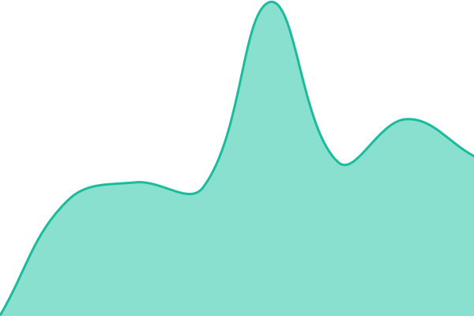
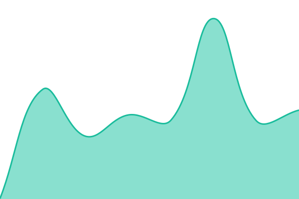

# <!--live status--> **🟩 All systems operational**

<!--start: status pages-->
<!-- This summary is generated by Upptime (https://github.com/upptime/upptime) -->
<!-- Do not edit this manually, your changes will be overwritten -->
<!-- prettier-ignore -->
| URL | Status | History | Response Time | Uptime |
| --- | ------ | ------- | ------------- | ------ |
|  [Allenstech.io](https://allenstech.io) | 🟩 Up | [allenstech-io.yml](https://github.com/allenstechio/homelab-status/commits/HEAD/history/allenstech-io.yml) | 

 168ms
     
 | 

<a href="https://allenstechio.github.io/homelab-status/history/allenstech-io">100.00%</a>
    

|  [Seer](https://request.allenstech.io) | 🟩 Up | [seer.yml](https://github.com/allenstechio/homelab-status/commits/HEAD/history/seer.yml) | 

 474ms
     
 | 

<a href="https://allenstechio.github.io/homelab-status/history/seer">100.00%</a>
    

|  [Gokapi](https://files.allenstech.io/login) | 🟩 Up | [gokapi.yml](https://github.com/allenstechio/homelab-status/commits/HEAD/history/gokapi.yml) | 

 228ms
     
 | 

<a href="https://allenstechio.github.io/homelab-status/history/gokapi">100.00%</a>
    

<!--end: status pages-->

[**Status website →**](https://allenstechio.github.io/homelab-status/)
